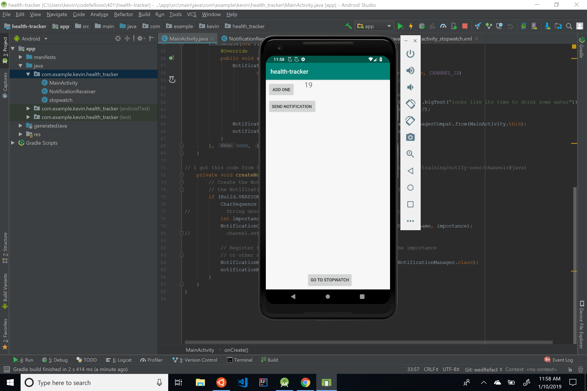
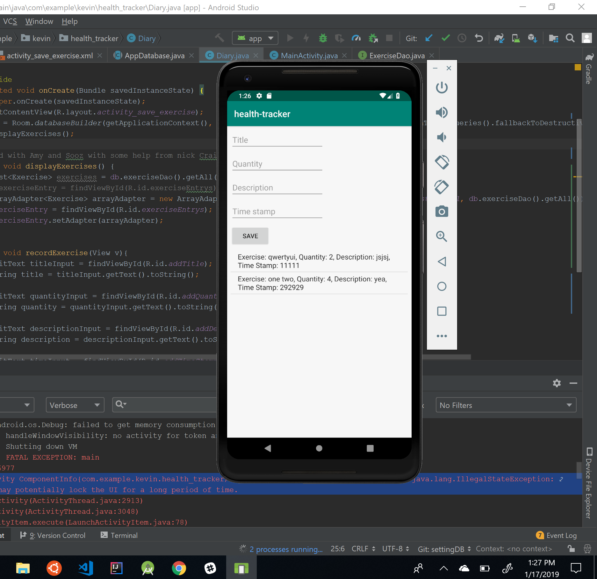

# Health Tracker
our first android app.
### lab 26 
For lab 26 we where tasked with creating our first android app that included a click counter that 
would track when you would click a button, a stopwatch, and an image Carousel.
### lab 27 
For lab 27 we where tasked with adding to our android app by adding Navigation, and Notifications
that pop us every two hours
### lab 28 
For lab 28 we where tasked with creating a data base for our android project using room. The
features we had to add where to add a working database, display the entry's from the database, and
last was to be able to add things to the database
###lab 29
For lab 29 we where tasked with creating 
### lab 32
 For lab 32 we where tasked with finishing lab 28. The features we had to add where to add a working
database, display the entry's from the database, and last was to be able to add things to the 
database

## Images 

### lab 26

### lab 28

## Resources 
* [Android fundamentals](https://developer.android.com/guide/components/fundamentals)
* [Android UI](https://developer.android.com/guide/topics/ui/)
* [Android Database](https://developer.android.com/topic/libraries/architecture/room)